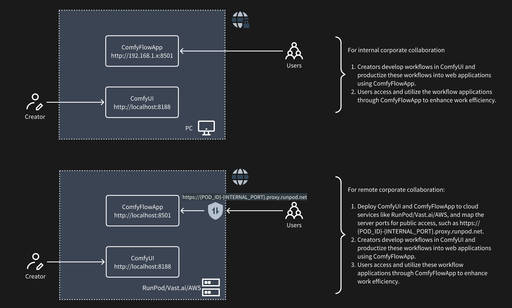

# 📌 Welcome to ComfyFlowApp

ComfyFlowApp is a tool to help you develop AI webapp from ComfyUI workflow and share to others.

English | [简体中文](./README_zh-CN.md)

## 📌 What is ComfyFlowApp?

ComfyFlowApp is an extension tool for ComfyUI, making it easy to create a user-friendly application from a ComfyUI workflow and lowering the barrier to using ComfyUI.

As shown in the images below, you can develop a web application from the workflow like "portrait retouching"


### Why You Need ComfyFlowApp?

If you want to generate an image using AI tools, you can choose MidJourney, DALL-E3, Fairfly (Adobe), or similar tools. These tools allow anyone to generate a beautiful image based on prompts. However, if you need more control over the generated results, like dressing a model in specific clothing, these tools may not suffice. Additionally, if your scenario has specific copyright requirements for images, you can use the open-source Stable Diffusion to build an AI image processing application. You have the choice of Stable-Diffusion-WebUI or ComfyUI, with WebUI being simple to use and having a rich plugin ecosystem for various processing needs. On the other hand, ComfyUI has a higher learning curve but offers more flexible workflow customization, allowing you to develop workflows for a wide range of scenarios.

If you need to share workflows developed in ComfyUI with other users, ComfyFlowApp can significantly lower the barrier for others to use your workflows:

- Users don't need to understand the principles of AI generation models.
- Users don't need to know the tuning parameters of various AI models.
- Users don't need to understand where to download models.
- Users don't need to know how to set up ComfyUI workflows.
- Users don't need to understand Python installation requirements.


**In summary, ComfyFlowApp make comfyui workflow easy to use.**


### Use Cases



**1. For internal corporate collaboration**

* Creators develop workflows in ComfyUI and productize these workflows into web applications using ComfyFlowApp.
* Users access and utilize the workflow applications through ComfyFlowApp to enhance work efficiency.

**2. For remote corporate collaboration**

* Deploy ComfyUI and ComfyFlowApp to cloud services like RunPod/Vast.ai/AWS, and map the server ports for public access, such as https://{POD_ID}-{INTERNAL_PORT}.proxy.runpod.net.
* Creators develop workflows in ComfyUI and productize these workflows into web applications using ComfyFlowApp.
* Users access and utilize these workflow applications through ComfyFlowApp to enhance work efficiency.

**3. For SaaS services**

* ComfyFlowApp provides an application hosting environment, including the model and ComfyUI extension nodes.
* Creators publish their workflow applications to ComfyFlowApp.
* Users subscribe to use the workflow applications.

**Follow the repo to get the latest updates.**


### 📌 Quick Start

ComfyFlowApp offers an in-built test account(username: demo) with the credentials(password: comfyflowapp). For an enhanced user experience, please sign up your account at https://comfyflow.app.

```bash
# download project
git clone https://github.com/xingren23/ComfyFlowApp

# create and activate python env
# Note: pytorch does not support python 3.12 yet so make sure your python version is 3.11 or earlier.
conda create -n comfyflowapp python=3.11
conda activate comfyflowapp

# install requirements
pip install -r requirements.txt

# start or run
# linux 
sh bin/creator_run.sh 
# windows
.\bin\creator_run.bat
```

or you could download integrated package fow windows
[comfyflowapp-python-3.11-amd64.7z](https://github.com/xingren23/ComfyFlowApp/releases)


env var, you could modify some env var as needed

```bash
:: log level default: INFO
set LOGURU_LEVEL=INFO

:: ComfyflowApp address，default: https://api.comfyflow.app
set COMFYFLOW_API_URL=https://api.comfyflow.app

:: comfyui env for developping，you could use other machine in the same LAN, default: http://localhost:8188
set COMFYUI_SERVER_ADDR=http://localhost:8188

:: webapp server address, others in the same LAN could visit your webapp, default: localhost
set STREAMLIT_SERVER_ADDRESS=192.168.1.100
```

### 📌 Related Projects

- [ComfyUI](https://github.com/comfyanonymous/ComfyUI)

### 📌 Contact Us

- [GitHub Issues](https://github.com/xingren23/ComfyWorkflowApp/issues)

- [ComfyFlowApp Discord](https://discord.gg/rjbdD3EkYw)

